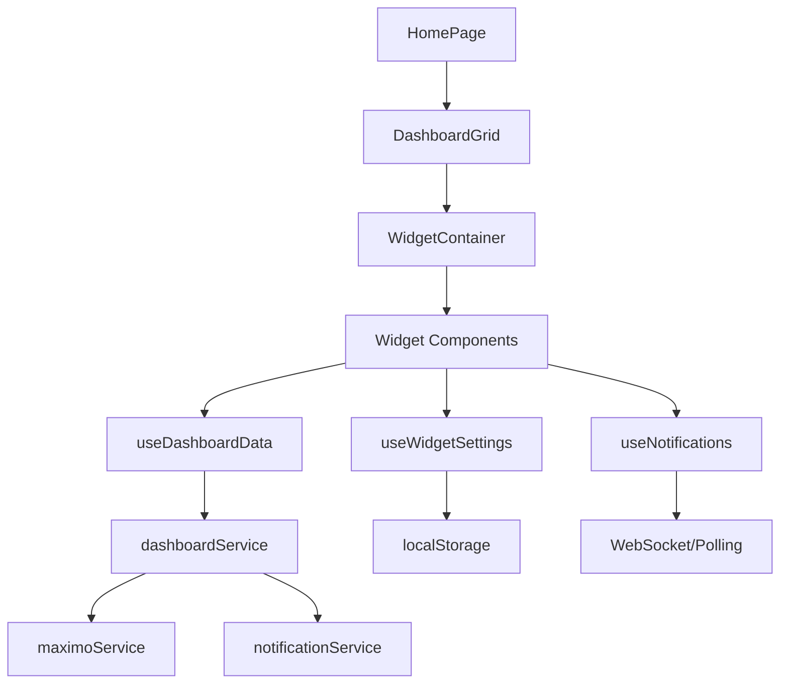

# Documento de Diseño - Página de Inicio Mejorada

## Visión General

La página de inicio mejorada será una interfaz rica e interactiva que reemplazará el dashboard actual, proporcionando una experiencia personalizada basada en el rol del usuario. Utilizará un sistema de widgets modulares con capacidades de personalización, notificaciones en tiempo real y métricas del sistema Maximo.

## Arquitectura

### Estructura de Componentes

```
HomeDashboard/
├── HomePage.tsx                    # Componente principal de la página
├── components/
│   ├── widgets/
│   │   ├── WelcomeWidget.tsx      # Widget de bienvenida personalizado
│   │   ├── SystemStatusWidget.tsx  # Estado del sistema Maximo
│   │   ├── TasksWidget.tsx        # Tareas pendientes del usuario
│   │   ├── MetricsWidget.tsx      # Métricas para administradores
│   │   ├── QuickActionsWidget.tsx # Acciones rápidas
│   │   ├── NotificationsWidget.tsx # Centro de notificaciones
│   │   └── WeatherWidget.tsx      # Widget opcional del clima
│   ├── layout/
│   │   ├── DashboardGrid.tsx      # Sistema de grid responsivo
│   │   ├── WidgetContainer.tsx    # Contenedor base para widgets
│   │   └── DashboardHeader.tsx    # Header con navegación
│   └── modals/
│       ├── NotificationModal.tsx   # Modal para detalles de notificaciones
│       ├── SettingsModal.tsx      # Modal de configuración de widgets
│       └── HelpModal.tsx          # Modal de ayuda contextual
├── hooks/
│   ├── useDashboardData.tsx       # Hook para datos del dashboard
│   ├── useWidgetSettings.tsx      # Hook para configuración de widgets
│   ├── useNotifications.tsx       # Hook para notificaciones
│   └── useSystemMetrics.tsx       # Hook para métricas del sistema
├── services/
│   ├── dashboardService.ts        # Servicio para datos del dashboard
│   ├── maximoService.ts           # Servicio de integración con Maximo
│   └── notificationService.ts     # Servicio de notificaciones
└── types/
    ├── dashboard.ts               # Tipos para el dashboard
    ├── widgets.ts                 # Tipos para widgets
    └── notifications.ts           # Tipos para notificaciones
```

### Flujo de Datos



## Componentes y Interfaces

### 1. HomePage (Componente Principal)

**Responsabilidades:**
- Renderizar el layout principal del dashboard
- Gestionar el estado global de widgets
- Coordinar la comunicación entre componentes
- Manejar la personalización del usuario

**Props Interface:**
```typescript
interface HomePageProps {
  className?: string;
}
```

### 2. Sistema de Widgets

#### WelcomeWidget
- Saludo personalizado con hora del día
- Información del último acceso
- Resumen de actividad reciente

#### SystemStatusWidget
- Estado de conectividad con Maximo
- Indicadores de rendimiento del sistema
- Alertas críticas del sistema

#### TasksWidget
- Work orders asignadas al usuario
- Tareas pendientes por prioridad
- Acceso rápido a detalles de tareas

#### MetricsWidget (Solo Administradores)
- Gráficos de rendimiento del sistema
- Estadísticas de uso
- Métricas de usuarios activos

#### QuickActionsWidget
- Accesos directos a funciones principales
- Botones de acción contextual según rol
- Enlaces a módulos de Maximo

#### NotificationsWidget
- Centro de notificaciones unificado
- Indicadores de notificaciones no leídas
- Filtros por tipo y prioridad

### 3. DashboardGrid (Sistema de Layout)

**Características:**
- Grid responsivo basado en CSS Grid
- Soporte para drag & drop de widgets
- Breakpoints para móvil, tablet y desktop
- Persistencia de configuración del usuario

**Breakpoints:**
- Mobile: 1 columna (< 768px)
- Tablet: 2 columnas (768px - 1024px)
- Desktop: 3-4 columnas (> 1024px)

### 4. Hooks Personalizados

#### useDashboardData
```typescript
interface DashboardData {
  systemStatus: SystemStatus;
  userTasks: Task[];
  notifications: Notification[];
  metrics?: SystemMetrics;
}

const useDashboardData = () => {
  // Implementación con React Query
  // Auto-refresh cada 30 segundos
  // Manejo de errores y estados de carga
}
```

#### useWidgetSettings
```typescript
interface WidgetSettings {
  enabledWidgets: string[];
  widgetOrder: string[];
  widgetSizes: Record<string, 'small' | 'medium' | 'large'>;
}

const useWidgetSettings = () => {
  // Persistencia en localStorage
  // Sincronización con backend (futuro)
  // Configuración por defecto según rol
}
```

## Modelos de Datos

### Dashboard Types
```typescript
interface SystemStatus {
  isConnected: boolean;
  lastSync: Date;
  performance: 'good' | 'warning' | 'critical';
  activeUsers: number;
  systemLoad: number;
}

interface Task {
  id: string;
  title: string;
  priority: 'low' | 'medium' | 'high' | 'critical';
  dueDate: Date;
  status: 'pending' | 'in_progress' | 'completed';
  assignedTo: string;
  workOrderNumber?: string;
}

interface Notification {
  id: string;
  type: 'info' | 'warning' | 'error' | 'success';
  title: string;
  message: string;
  timestamp: Date;
  isRead: boolean;
  actionUrl?: string;
}

interface SystemMetrics {
  cpuUsage: number;
  memoryUsage: number;
  diskUsage: number;
  networkLatency: number;
  activeConnections: number;
  errorRate: number;
}
```

### Widget Configuration
```typescript
interface WidgetConfig {
  id: string;
  name: string;
  component: React.ComponentType;
  defaultSize: 'small' | 'medium' | 'large';
  minSize: 'small' | 'medium' | 'large';
  requiredRole?: UserRole[];
  refreshInterval?: number;
  isOptional: boolean;
}
```

## Manejo de Errores

### Estrategias de Error
1. **Errores de Conectividad:** Mostrar indicador de estado offline
2. **Errores de Datos:** Fallback a datos en caché con indicador
3. **Errores de Widget:** Mostrar widget de error sin afectar otros
4. **Errores Críticos:** Modal de error con opción de recargar

### Error Boundaries
- Error boundary por widget para aislamiento
- Error boundary global para errores críticos
- Logging de errores para debugging

## Estrategia de Testing

### Pruebas Unitarias
- Componentes de widgets individuales
- Hooks personalizados con diferentes estados
- Servicios de datos con mocks
- Utilidades de configuración

### Pruebas de Integración
- Flujo completo de carga del dashboard
- Interacciones entre widgets
- Persistencia de configuración
- Manejo de estados de error

### Pruebas E2E
- Navegación completa del dashboard
- Personalización de widgets
- Notificaciones en tiempo real
- Responsividad en diferentes dispositivos

## Consideraciones de Rendimiento

### Optimizaciones
1. **Lazy Loading:** Widgets se cargan bajo demanda
2. **Memoización:** React.memo para widgets estáticos
3. **Virtualización:** Para listas largas de notificaciones/tareas
4. **Debouncing:** Para actualizaciones de configuración
5. **Caching:** React Query para datos del servidor

### Métricas de Rendimiento
- Tiempo de carga inicial < 2 segundos
- Tiempo de respuesta de widgets < 500ms
- Uso de memoria optimizado para dispositivos móviles
- Smooth animations (60fps)

## Seguridad

### Medidas de Seguridad
1. **Autorización por Rol:** Widgets visibles según permisos
2. **Sanitización:** Todos los datos de entrada sanitizados
3. **Rate Limiting:** Límites en actualizaciones automáticas
4. **Validación:** Validación de configuración del usuario
5. **Audit Trail:** Log de cambios de configuración

## Accesibilidad

### Estándares WCAG 2.1
- Navegación por teclado completa
- Lectores de pantalla compatibles
- Contraste de colores adecuado
- Textos alternativos para elementos visuales
- Focus management apropiado

### Características Específicas
- Skip links para navegación rápida
- Aria labels descriptivos
- Keyboard shortcuts para acciones comunes
- Modo de alto contraste
- Soporte para zoom hasta 200%

## Integración con Maximo

### APIs Requeridas
1. **System Status API:** Estado del sistema en tiempo real
2. **Work Orders API:** Tareas asignadas al usuario
3. **Notifications API:** Alertas y notificaciones
4. **Metrics API:** Datos de rendimiento (admin)
5. **User Preferences API:** Configuración personalizada

### Manejo de Datos
- Polling cada 30 segundos para datos críticos
- WebSocket para notificaciones en tiempo real
- Caché local con TTL apropiado
- Sincronización offline cuando sea posible

## Diseño Visual

### Sistema de Diseño
- Continuidad con el tema glassmorphism existente
- Paleta de colores quantum (azul, púrpura, índigo)
- Tipografía consistente con el sistema actual
- Iconografía de Lucide React
- Animaciones suaves y profesionales

### Layout Responsivo
- Mobile-first approach
- Breakpoints estándar de Tailwind
- Grid flexible que se adapta al contenido
- Touch-friendly en dispositivos móviles