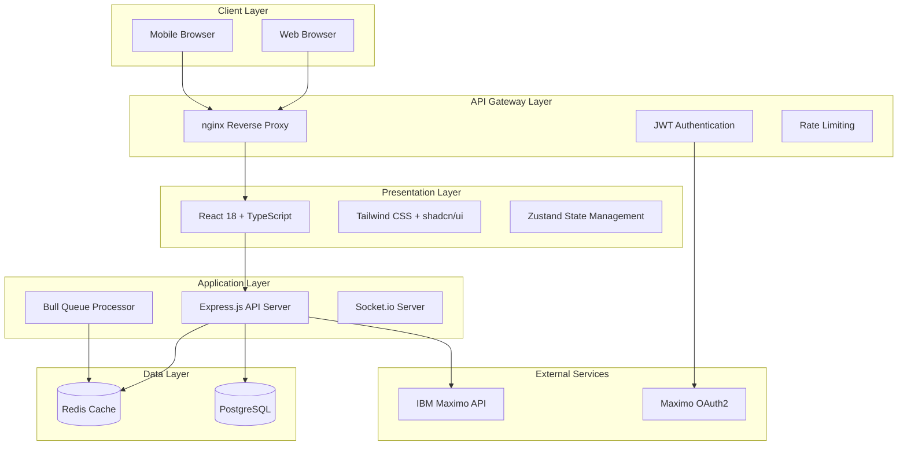
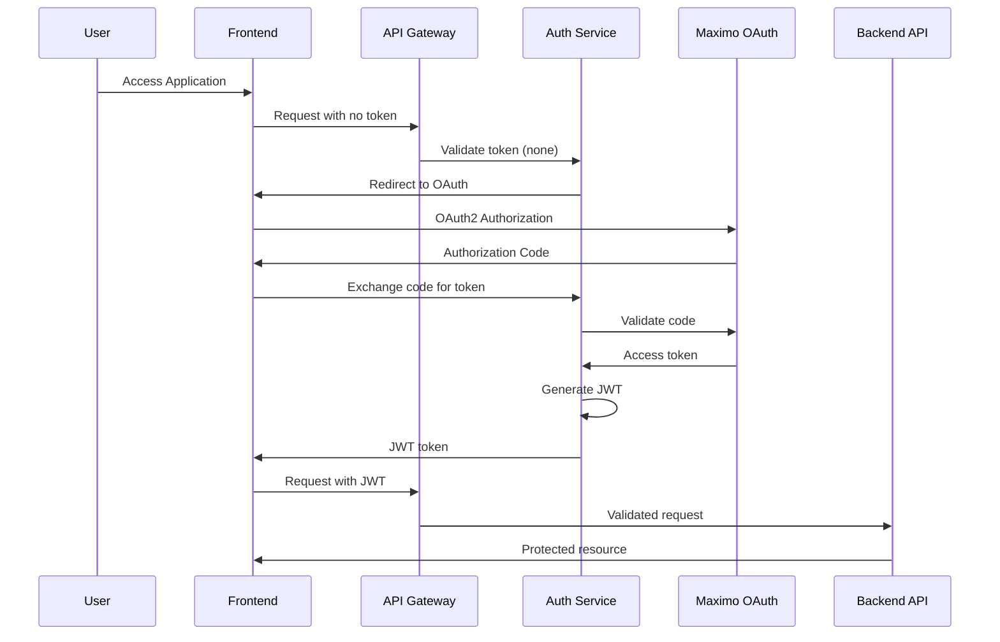

# Design Document

## Overview

Quantum Asset IA Foundation establece la arquitectura base para un portal web de integración con IBM Maximo Application Suite potenciado por Watson X AI. El diseño sigue una arquitectura de microservicios con separación clara entre frontend y backend, implementando patrones de seguridad robustos y escalabilidad desde el inicio.

La solución utiliza React 18 + TypeScript para el frontend con un diseño glassmorphism moderno, Node.js + Express para el backend con autenticación OAuth2, y una infraestructura containerizada con Docker para facilitar el desarrollo y despliegue.

## Architecture

### High-Level Architecture



### Security Architecture



## Components and Interfaces

### Frontend Components

#### 1. Authentication Module
- **LoginPage**: Maneja el flujo OAuth2 con Maximo
- **AuthProvider**: Context provider para estado de autenticación
- **ProtectedRoute**: HOC para rutas que requieren autenticación
- **TokenManager**: Servicio para manejo de JWT tokens

```typescript
interface AuthState {
  user: User | null;
  token: string | null;
  isAuthenticated: boolean;
  isLoading: boolean;
}

interface AuthActions {
  login: (credentials: LoginCredentials) => Promise<void>;
  logout: () => void;
  refreshToken: () => Promise<void>;
  checkAuth: () => Promise<boolean>;
}
```

#### 2. Dashboard Module
- **DashboardLayout**: Layout principal con navegación
- **MetricsCards**: Componentes para mostrar KPIs básicos
- **AssetChart**: Gráfica de assets activos usando Recharts
- **WorkOrderChart**: Visualización de work orders por estado
- **RefreshIndicator**: Componente para mostrar estado de actualización

```typescript
interface DashboardMetrics {
  totalAssets: number;
  activeAssets: number;
  workOrdersByStatus: {
    open: number;
    inProgress: number;
    closed: number;
  };
  lastUpdated: Date;
}
```

#### 3. UI Components (shadcn/ui based)
- **Button**: Botones con variantes glassmorphism
- **Card**: Contenedores con efecto glass
- **LoadingSpinner**: Indicador de carga animado
- **ErrorBoundary**: Manejo de errores de React
- **Toast**: Notificaciones no intrusivas

### Backend Components

#### 1. Authentication Service
- **OAuthController**: Maneja flujo OAuth2 con Maximo
- **JWTService**: Generación y validación de tokens JWT
- **AuthMiddleware**: Middleware para validar requests
- **SessionManager**: Gestión de sesiones con Redis

```typescript
interface AuthController {
  initiateOAuth(req: Request, res: Response): Promise<void>;
  handleCallback(req: Request, res: Response): Promise<void>;
  refreshToken(req: Request, res: Response): Promise<void>;
  logout(req: Request, res: Response): Promise<void>;
}
```

#### 2. Maximo Integration Service
- **MaximoClient**: Cliente HTTP para API de Maximo
- **AssetService**: Operaciones CRUD para assets
- **WorkOrderService**: Gestión de work orders
- **ConnectionManager**: Manejo de conexiones y retry logic

```typescript
interface MaximoClient {
  authenticate(token: string): Promise<boolean>;
  getAssets(filters?: AssetFilters): Promise<Asset[]>;
  getWorkOrders(filters?: WorkOrderFilters): Promise<WorkOrder[]>;
  healthCheck(): Promise<boolean>;
}
```

#### 3. API Controllers
- **DashboardController**: Endpoints para métricas del dashboard
- **HealthController**: Health checks y status del sistema
- **ErrorController**: Manejo centralizado de errores

## Data Models

### Core Entities

#### User Model
```typescript
interface User {
  id: string;
  username: string;
  email: string;
  roles: string[];
  maximoUserId: string;
  lastLogin: Date;
  preferences: UserPreferences;
}

interface UserPreferences {
  theme: 'light' | 'dark';
  language: 'es' | 'en';
  dashboardRefreshInterval: number;
}
```

#### Asset Model (from Maximo)
```typescript
interface Asset {
  assetnum: string;
  description: string;
  status: string;
  location: string;
  assettype: string;
  siteid: string;
  orgid: string;
  changedate: Date;
  changeby: string;
}

interface AssetFilters {
  status?: string[];
  location?: string;
  assettype?: string;
  siteid?: string;
  limit?: number;
  offset?: number;
}
```

#### Work Order Model (from Maximo)
```typescript
interface WorkOrder {
  wonum: string;
  description: string;
  status: string;
  worktype: string;
  assetnum?: string;
  location?: string;
  siteid: string;
  orgid: string;
  schedstart?: Date;
  schedfinish?: Date;
  actstart?: Date;
  actfinish?: Date;
}
```

### Database Schema (PostgreSQL)

#### Sessions Table
```sql
CREATE TABLE user_sessions (
  id UUID PRIMARY KEY DEFAULT gen_random_uuid(),
  user_id VARCHAR(255) NOT NULL,
  jwt_token TEXT NOT NULL,
  refresh_token TEXT,
  expires_at TIMESTAMP NOT NULL,
  created_at TIMESTAMP DEFAULT CURRENT_TIMESTAMP,
  last_accessed TIMESTAMP DEFAULT CURRENT_TIMESTAMP
);
```

#### Audit Logs Table
```sql
CREATE TABLE audit_logs (
  id UUID PRIMARY KEY DEFAULT gen_random_uuid(),
  user_id VARCHAR(255) NOT NULL,
  action VARCHAR(100) NOT NULL,
  resource VARCHAR(255),
  details JSONB,
  ip_address INET,
  user_agent TEXT,
  created_at TIMESTAMP DEFAULT CURRENT_TIMESTAMP
);
```

#### System Configuration Table
```sql
CREATE TABLE system_config (
  key VARCHAR(255) PRIMARY KEY,
  value JSONB NOT NULL,
  description TEXT,
  updated_by VARCHAR(255),
  updated_at TIMESTAMP DEFAULT CURRENT_TIMESTAMP
);
```

## Error Handling

### Frontend Error Handling

#### Error Boundary Strategy
```typescript
class GlobalErrorBoundary extends Component<Props, State> {
  static getDerivedStateFromError(error: Error): State {
    return { hasError: true, error };
  }

  componentDidCatch(error: Error, errorInfo: ErrorInfo) {
    // Log to monitoring service
    console.error('Global error:', error, errorInfo);
    // Send to backend for logging
    this.logError(error, errorInfo);
  }
}
```

#### API Error Handling
```typescript
interface APIError {
  code: string;
  message: string;
  details?: any;
  timestamp: Date;
}

const handleAPIError = (error: AxiosError): APIError => {
  if (error.response?.status === 401) {
    // Redirect to login
    authStore.logout();
  }
  
  return {
    code: error.response?.data?.code || 'UNKNOWN_ERROR',
    message: error.response?.data?.message || 'An unexpected error occurred',
    details: error.response?.data?.details,
    timestamp: new Date()
  };
};
```

### Backend Error Handling

#### Global Error Middleware
```typescript
const errorHandler = (
  err: Error,
  req: Request,
  res: Response,
  next: NextFunction
) => {
  logger.error('Unhandled error:', {
    error: err.message,
    stack: err.stack,
    url: req.url,
    method: req.method,
    userId: req.user?.id
  });

  if (err instanceof ValidationError) {
    return res.status(400).json({
      code: 'VALIDATION_ERROR',
      message: err.message,
      details: err.details
    });
  }

  if (err instanceof MaximoAPIError) {
    return res.status(502).json({
      code: 'MAXIMO_API_ERROR',
      message: 'Error connecting to Maximo',
      details: err.message
    });
  }

  res.status(500).json({
    code: 'INTERNAL_SERVER_ERROR',
    message: 'An unexpected error occurred'
  });
};
```

#### Maximo API Error Handling
```typescript
class MaximoAPIError extends Error {
  constructor(
    public statusCode: number,
    public maximoError: string,
    public originalError?: any
  ) {
    super(`Maximo API Error: ${maximoError}`);
  }
}

const handleMaximoError = (error: AxiosError): never => {
  const status = error.response?.status || 500;
  const message = error.response?.data?.message || error.message;
  
  throw new MaximoAPIError(status, message, error);
};
```

## Testing Strategy

### Frontend Testing

#### Unit Tests (Jest + React Testing Library)
```typescript
// Component testing example
describe('DashboardMetrics', () => {
  it('should display loading state initially', () => {
    render(<DashboardMetrics />);
    expect(screen.getByTestId('loading-spinner')).toBeInTheDocument();
  });

  it('should display metrics when data is loaded', async () => {
    const mockMetrics = { totalAssets: 100, activeAssets: 85 };
    jest.mocked(useDashboardMetrics).mockReturnValue({
      data: mockMetrics,
      isLoading: false
    });

    render(<DashboardMetrics />);
    
    expect(screen.getByText('100')).toBeInTheDocument();
    expect(screen.getByText('85')).toBeInTheDocument();
  });
});
```

#### Integration Tests (Cypress)
```typescript
// E2E testing example
describe('Authentication Flow', () => {
  it('should redirect to Maximo OAuth when not authenticated', () => {
    cy.visit('/dashboard');
    cy.url().should('include', '/auth/login');
    cy.get('[data-testid="oauth-login-button"]').click();
    cy.origin('maximo-oauth-server.com', () => {
      cy.url().should('include', 'oauth/authorize');
    });
  });
});
```

### Backend Testing

#### Unit Tests (Jest + Supertest)
```typescript
// API endpoint testing
describe('Dashboard API', () => {
  it('should return dashboard metrics for authenticated user', async () => {
    const token = generateValidJWT({ userId: 'test-user' });
    
    const response = await request(app)
      .get('/api/dashboard/metrics')
      .set('Authorization', `Bearer ${token}`)
      .expect(200);

    expect(response.body).toHaveProperty('totalAssets');
    expect(response.body).toHaveProperty('workOrdersByStatus');
  });

  it('should return 401 for unauthenticated requests', async () => {
    await request(app)
      .get('/api/dashboard/metrics')
      .expect(401);
  });
});
```

#### Integration Tests
```typescript
// Maximo integration testing
describe('Maximo Integration', () => {
  it('should fetch assets from Maximo API', async () => {
    const mockMaximoResponse = { assets: [{ assetnum: 'A001' }] };
    nock('https://maximo-server.com')
      .get('/maximo/oslc/os/mxasset')
      .reply(200, mockMaximoResponse);

    const assets = await maximoClient.getAssets();
    expect(assets).toHaveLength(1);
    expect(assets[0].assetnum).toBe('A001');
  });
});
```

### Performance Testing

#### Load Testing Strategy
- **Artillery.js** para pruebas de carga de API endpoints
- **Lighthouse CI** para métricas de performance del frontend
- **Redis monitoring** para cache hit rates
- **Database query optimization** con explain plans

#### Monitoring and Observability
- **Winston** structured logging con correlation IDs
- **Prometheus metrics** para métricas de aplicación
- **Health check endpoints** para monitoring de servicios
- **Error tracking** con Sentry o similar