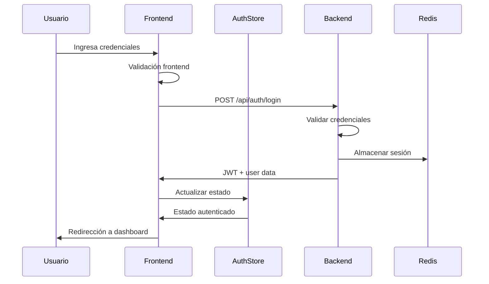

# Documento de Diseño - Sistema de Autenticación

## Visión General

El sistema de autenticación para Quantum Asset IA implementará una página de inicio de sesión moderna utilizando React 18, TypeScript, y Tailwind CSS con un diseño glassmorphism que se alinea con la identidad visual existente de la aplicación. La solución aprovechará el stack tecnológico actual incluyendo React Router para navegación, Zustand para gestión de estado, React Query para manejo de datos, y Axios para comunicación con la API.

## Arquitectura

### Arquitectura Frontend
```
src/
├── components/
│   └── auth/
│       ├── LoginForm.tsx          # Componente principal del formulario
│       ├── LoginPage.tsx          # Página completa de login
│       └── AuthLayout.tsx         # Layout compartido para auth
├── hooks/
│   └── auth/
│       ├── useAuth.tsx            # Hook personalizado para autenticación
│       └── useLogin.tsx           # Hook para lógica de login
├── stores/
│   └── authStore.ts               # Store de Zustand para estado de auth
├── services/
│   └── authService.ts             # Servicios de API para autenticación
├── types/
│   └── auth.ts                    # Tipos TypeScript para auth
└── utils/
    └── validation.ts              # Utilidades de validación
```

### Arquitectura Backend (Endpoints Requeridos)
```
/api/auth/
├── POST /login                    # Autenticación de usuario
├── POST /logout                   # Cerrar sesión
├── POST /refresh                  # Renovar token
└── POST /forgot-password          # Recuperación de contraseña
```

### Flujo de Autenticación


## Componentes e Interfaces

### 1. LoginPage Component
**Responsabilidad:** Página principal que contiene el layout y formulario de login

**Props Interface:**
```typescript
interface LoginPageProps {
  redirectTo?: string;
}
```

**Características:**
- Layout glassmorphism con gradiente de fondo
- Logo de Quantum Asset IA prominente
- Formulario centrado y responsivo
- Enlaces de navegación adicionales

### 2. LoginForm Component
**Responsabilidad:** Formulario de autenticación con validación y manejo de estado

**Props Interface:**
```typescript
interface LoginFormProps {
  onSuccess?: (user: User) => void;
  onError?: (error: string) => void;
}
```

**Estado Interno:**
```typescript
interface LoginFormState {
  email: string;
  password: string;
  isLoading: boolean;
  errors: {
    email?: string;
    password?: string;
    general?: string;
  };
  showPassword: boolean;
}
```

### 3. AuthLayout Component
**Responsabilidad:** Layout compartido para páginas de autenticación

**Características:**
- Fondo con gradiente quantum (blue-purple-indigo)
- Efectos glassmorphism
- Diseño responsivo
- Animaciones suaves

### 4. useAuth Hook
**Responsabilidad:** Hook personalizado para gestión de estado de autenticación

**Interface:**
```typescript
interface UseAuthReturn {
  user: User | null;
  isAuthenticated: boolean;
  isLoading: boolean;
  login: (credentials: LoginCredentials) => Promise<void>;
  logout: () => void;
  error: string | null;
}
```

### 5. useLogin Hook
**Responsabilidad:** Hook específico para lógica de inicio de sesión

**Interface:**
```typescript
interface UseLoginReturn {
  login: (credentials: LoginCredentials) => Promise<void>;
  isLoading: boolean;
  error: string | null;
  reset: () => void;
}
```

## Modelos de Datos

### User Model
```typescript
interface User {
  id: string;
  email: string;
  firstName: string;
  lastName: string;
  role: UserRole;
  avatar?: string;
  lastLogin: Date;
  preferences: UserPreferences;
}

enum UserRole {
  ADMIN = 'admin',
  USER = 'user',
  VIEWER = 'viewer'
}

interface UserPreferences {
  theme: 'light' | 'dark' | 'system';
  language: string;
  notifications: boolean;
}
```

### Authentication Models
```typescript
interface LoginCredentials {
  email: string;
  password: string;
  rememberMe?: boolean;
}

interface AuthResponse {
  user: User;
  accessToken: string;
  refreshToken: string;
  expiresIn: number;
}

interface AuthError {
  code: string;
  message: string;
  field?: string;
}
```

### Validation Schema
```typescript
interface ValidationRules {
  email: {
    required: true;
    pattern: /^[^\s@]+@[^\s@]+\.[^\s@]+$/;
    message: string;
  };
  password: {
    required: true;
    minLength: 8;
    message: string;
  };
}
```

## Manejo de Errores

### Estrategia de Errores Frontend
1. **Validación en Tiempo Real:** Validación de formato de email mientras el usuario escribe
2. **Errores de Formulario:** Mensajes específicos por campo con estilos visuales claros
3. **Errores de Red:** Manejo de timeouts, errores de conexión y respuestas del servidor
4. **Errores de Autenticación:** Mensajes genéricos para evitar revelar información sensible

### Tipos de Error
```typescript
enum AuthErrorType {
  INVALID_CREDENTIALS = 'invalid_credentials',
  NETWORK_ERROR = 'network_error',
  VALIDATION_ERROR = 'validation_error',
  RATE_LIMIT = 'rate_limit',
  SERVER_ERROR = 'server_error'
}

interface ErrorHandling {
  display: (error: AuthError) => string;
  log: (error: AuthError) => void;
  retry: (action: () => Promise<void>) => Promise<void>;
}
```

### Mensajes de Error
- **Credenciales inválidas:** "Email o contraseña incorrectos"
- **Campos requeridos:** "Este campo es obligatorio"
- **Formato de email:** "Ingresa un email válido"
- **Error de red:** "Error de conexión. Intenta nuevamente"
- **Límite de intentos:** "Demasiados intentos. Intenta en unos minutos"

## Estrategia de Testing

### Pruebas Unitarias
- **Componentes:** Testing de renderizado, props y eventos
- **Hooks:** Testing de lógica de estado y efectos
- **Servicios:** Testing de llamadas API y manejo de errores
- **Validaciones:** Testing de reglas de validación

### Pruebas de Integración
- **Flujo de Login:** Desde formulario hasta redirección
- **Manejo de Estado:** Integración entre hooks y store
- **Navegación:** Testing de rutas y redirecciones

### Herramientas de Testing
- **Vitest:** Framework de testing principal
- **React Testing Library:** Testing de componentes
- **MSW:** Mock Service Worker para APIs
- **Jest DOM:** Matchers adicionales para DOM

### Casos de Prueba Críticos
```typescript
describe('Login Flow', () => {
  test('successful login redirects to dashboard');
  test('invalid credentials show error message');
  test('network error shows retry option');
  test('form validation prevents submission');
  test('loading state disables form during request');
});
```

## Consideraciones de Seguridad

### Frontend Security
1. **Validación de Input:** Sanitización y validación de todos los inputs
2. **Token Storage:** Almacenamiento seguro de JWT en httpOnly cookies
3. **HTTPS Only:** Forzar conexiones seguras en producción
4. **CSP Headers:** Content Security Policy para prevenir XSS

### Rate Limiting
- **Frontend:** Debounce en formularios para evitar spam
- **Backend:** Límite de intentos por IP y por usuario
- **Redis:** Cache para tracking de intentos fallidos

### Password Security
- **Frontend:** Campo de contraseña oculto por defecto con opción de mostrar
- **Backend:** Hashing con bcrypt y salt
- **Políticas:** Validación de complejidad de contraseña

## Diseño Visual

### Paleta de Colores
```css
:root {
  --quantum-blue: #3B82F6;
  --quantum-purple: #8B5CF6;
  --quantum-indigo: #6366F1;
  --glass-50: rgba(255, 255, 255, 0.1);
  --glass-100: rgba(255, 255, 255, 0.2);
  --glass-200: rgba(255, 255, 255, 0.3);
}
```

### Glassmorphism Design System
- **Fondo:** Gradiente de blue-900 a purple-900 a indigo-900
- **Tarjetas:** backdrop-blur-md con bordes semi-transparentes
- **Inputs:** Fondo glass-50 con bordes glass-100
- **Botones:** Gradiente quantum con efectos hover

### Responsive Breakpoints
- **Mobile:** 320px - 768px (formulario stack vertical)
- **Tablet:** 768px - 1024px (formulario centrado)
- **Desktop:** 1024px+ (layout con imagen lateral opcional)

### Animaciones
- **Entrada:** Fade-in suave para el formulario
- **Loading:** Spinner con colores quantum
- **Errores:** Shake animation para campos inválidos
- **Hover:** Transiciones suaves en botones y enlaces

## Accesibilidad

### WCAG 2.1 Compliance
- **Contraste:** Mínimo 4.5:1 para texto normal
- **Navegación:** Soporte completo para teclado
- **Screen Readers:** Labels apropiados y aria-attributes
- **Focus Management:** Indicadores visuales claros

### Implementación
```typescript
interface AccessibilityProps {
  'aria-label': string;
  'aria-describedby'?: string;
  'aria-invalid'?: boolean;
  role?: string;
}
```

## Performance

### Optimizaciones
- **Code Splitting:** Lazy loading de componentes de auth
- **Bundle Size:** Tree shaking de librerías no utilizadas
- **Caching:** React Query para cache de datos de usuario
- **Images:** Optimización del logo QAI

### Métricas Target
- **First Contentful Paint:** < 1.5s
- **Largest Contentful Paint:** < 2.5s
- **Cumulative Layout Shift:** < 0.1
- **First Input Delay:** < 100ms